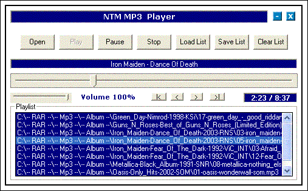

## NTM MP3 Player 1\.0 BETA \*Update 3\*

### Description

*Updated*

..

Fix: I fixed the bug that caused the program to crash when you removed the last song from the playlist with mnuRemove.

..

Fix: I fixed one minor bug that disabled cmdSave and cmdClear even if it was songs in the playlist.

..

*Updated*

..

*Updated 2*

I added lots of stuff, i´ve refine the designe some, not much. I have fixed som bugs, and I´ve added i Play Fast Forward/Backward kind athing =)

I hope u like it and please leave comments

*Updated 2*

..

This small mp3 player has support for Save and Load Playlist, Drag and Drop, Computer Uptime etc etc.This mp3 player was made to take no place at all, u can minimize it to the system tray and still do everything. Please leave a comment if u downloaded the code and are happy about it and realy if yuor not, I want to know
 
### More Info
 

             |
---                |---
**Submitted On**   |2004-08-18 13:53:24
**By**             |[NeoTheMaster](https://github.com/Planet-Source-Code/PSCIndex/blob/master/ByAuthor/neothemaster.md)
**Level**          |Intermediate
**User Rating**    |5.0 (10 globes from 2 users)
**Compatibility**  |VB 6\.0
**Category**       |[Sound/MP3](https://github.com/Planet-Source-Code/PSCIndex/blob/master/ByCategory/sound-mp3__1-45.md)
**World**          |[Visual Basic](https://github.com/Planet-Source-Code/PSCIndex/blob/master/ByWorld/visual-basic.md)
**Archive File**   |[NTM\_MP3\_Pl1787258292004\.zip](https://github.com/Planet-Source-Code/neothemaster-ntm-mp3-player-1-0-beta-update-3__1-55657/archive/master.zip)

